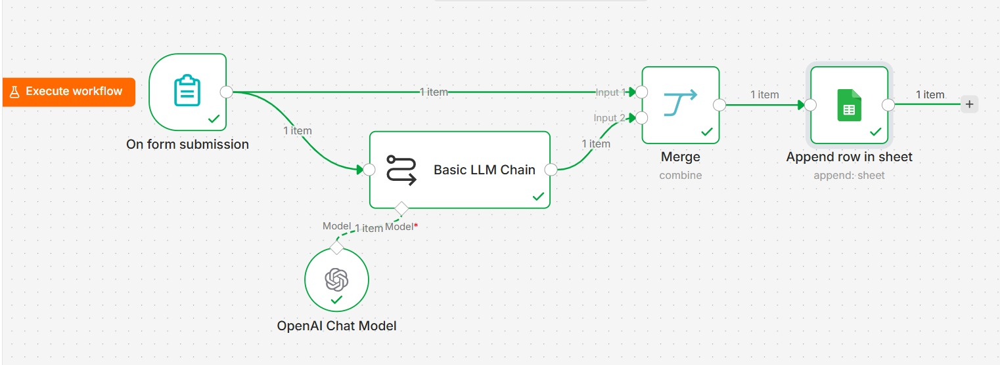
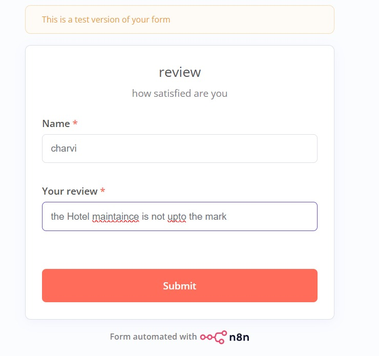
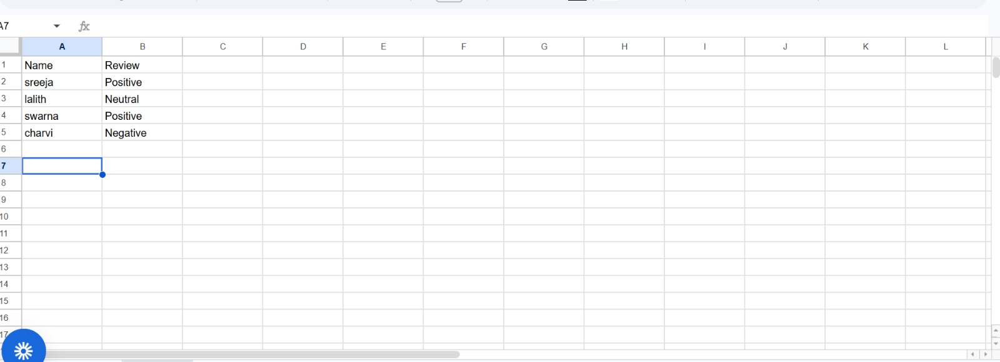

# AI-Powered Sentiment Analysis Automation using n8n

## Project Overview

This project is an AI-powered workflow automation system built using n8n, OpenAI GPT-4o-mini, and Google Sheets.

The workflow collects customer reviews through a web form, processes the review using a Large Language Model (LLM), performs sentiment analysis, and automatically stores the classified output into Google Sheets.

The project demonstrates practical implementation of:
- Workflow automation
- Prompt engineering
- LLM orchestration
- Data mapping
- Token optimization
- AI pipeline design

---

# Workflow Architecture



---

# Review Collection Form



---

# Google Sheets Output



---

# Technologies Used

| Technology | Purpose |
|---|---|
| n8n | Workflow Automation |
| OpenAI GPT-4o-mini | Sentiment Classification |
| Google Sheets API | Data Storage |
| Prompt Engineering | AI Response Control |
| Merge Node | Data Combination |
| Form Trigger | User Input Collection |

---

# Complete Workflow Explanation

## 1. Form Trigger Node

The workflow begins with the **On Form Submission** node.

This node collects:
- Reviewer Name
- Customer Review

The form acts as the entry point of the automation pipeline.

---

## 2. Basic LLM Chain

Instead of directly connecting the OpenAI node to the form trigger, a **Basic LLM Chain** node is used.

This is an important workflow design decision.

The Basic LLM Chain helps:
- Define custom prompts
- Control AI behavior
- Specify exact input for the LLM
- Process review text before sending to the model
- Structure output for downstream nodes

The prompt used:

```txt
You are an expert in sentiment analysis.
You conduct evaluations and determine which of the three options applies:

Positive
Negative
Neutral

You respond with only one word.
```

This ensures the model always returns:
- Positive
- Negative
- Neutral

without unnecessary explanations.

---

## 3. OpenAI Chat Model

The OpenAI Chat Model node is connected to the Basic LLM Chain.

Model used:
- GPT-4o-mini

The review text collected from the form is sent to the model for sentiment classification.

---

# Why Basic LLM Chain Was Used Instead of Direct OpenAI Connection

Although the OpenAI node can technically be connected directly to the form trigger, the Basic LLM Chain was intentionally added for better workflow orchestration.

Advantages:
- Better prompt control
- Structured AI interaction
- Easier response handling
- Cleaner workflow design
- Better scalability for future enhancements

This design follows practical LLM engineering principles.

---

# Token Optimization Strategy

The reviewer name could have been sent directly into the OpenAI prompt.

However, that would unnecessarily increase token usage.

To optimize tokens:
- Only the review text is sent to the LLM
- Reviewer name is preserved separately
- The Merge node later combines:
  - Original reviewer name
  - AI-generated sentiment result

This reduces unnecessary token consumption and improves efficiency.

---

## 4. Merge Node

The Merge node combines:
- Original form data
- AI-generated sentiment classification

Input 1:
- Reviewer Name

Input 2:
- Sentiment output from LLM

This combined structured data is then passed to Google Sheets.

---

# Why Merge Node Was Added

Google Sheets could have been connected directly after the LLM response.

However, the Merge node was intentionally added to:
- Preserve original reviewer information
- Avoid sending unnecessary data to the LLM
- Reduce token usage
- Maintain cleaner workflow structure
- Enable structured database insertion

This reflects practical workflow optimization techniques used in real-world automation systems.

---

## 5. Google Sheets Integration

The final structured output is stored automatically in Google Sheets.

Each column was manually mapped inside the Google Sheets node.

Mapped fields:
- Name
- Review Sentiment

Manual mapping ensures:
- Controlled data placement
- Structured spreadsheet formatting
- Better scalability for future database integrations

---

# Workflow Execution Flow

```text
Form Submission
       ↓
Basic LLM Chain
       ↓
OpenAI GPT-4o-mini
       ↓
Merge Node
       ↓
Google Sheets
```

---

# Features

- AI-powered sentiment analysis
- Automated workflow execution
- Prompt-engineered LLM responses
- Token optimization strategy
- Structured data merging
- Manual column mapping
- Google Sheets automation
- Real-time review classification
- Low-code AI integration
- Scalable workflow design

---

# Sample Input and Output

| Customer Review | Predicted Sentiment |
|---|---|
| Excellent hotel service | Positive |
| Room maintenance is poor | Negative |
| Average experience | Neutral |

---

# Use Cases

- Hotel Review Analysis
- Product Feedback Monitoring
- Customer Experience Analytics
- Survey Automation
- Review Classification
- AI-powered CRM pipelines
- Automated Feedback Systems

---

# Future Enhancements

- Multi-language sentiment analysis
- Dashboard visualization
- WhatsApp integration
- Email automation
- Sentiment scoring
- Database integration
- Admin analytics panel
- Real-time alerts

---

# Project Structure

```bash
sentiment-analysis-automation/
│
├── workflow/
│   └── sentiment-analysis-workflow.json
│
├── screenshots/
│   ├── workflow-architecture.jpeg
│   ├── review-form.jpeg
│   └── google-sheets-output.jpeg
│
├── docs/
├── assets/
└── README.md
```

---

# Setup Instructions

## Step 1

Import the workflow JSON into n8n.

---

## Step 2

Configure:
- OpenAI API credentials
- Google Sheets OAuth credentials

---

## Step 3

Run the workflow.

---

## Step 4

Submit reviews through the form interface.

---

# Author

Sreeja Reddy

---

# License

This project is licensed under the MIT License.
